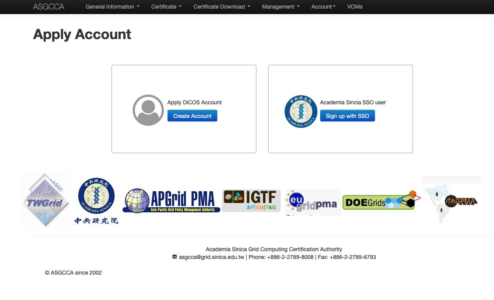
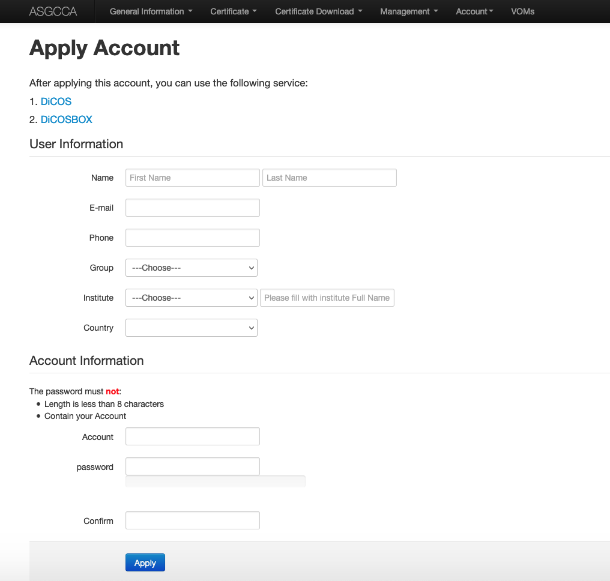
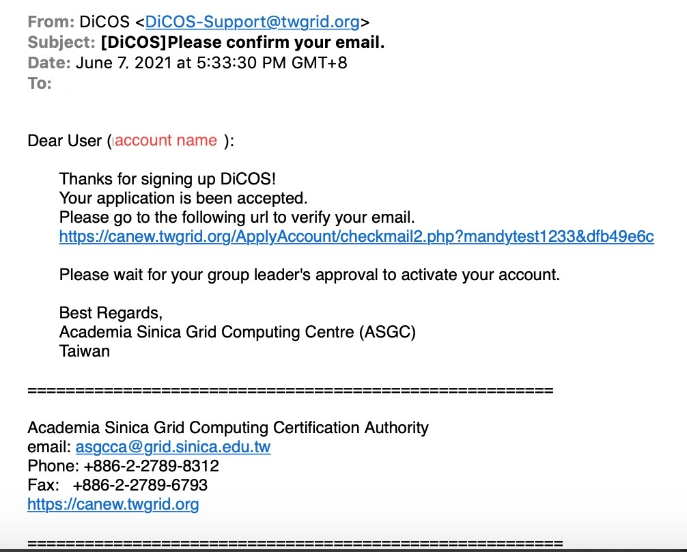
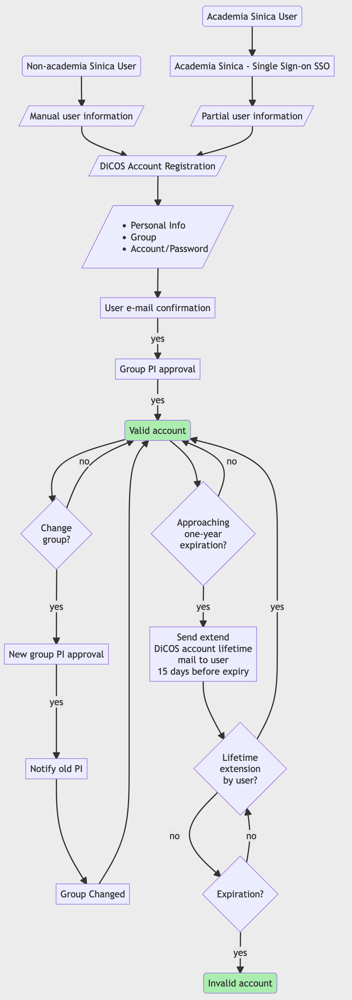

****************
DiCOS Account
****************

==========================
Apply for a DiCOS Account
==========================

Step 1: DiCOS Account Application
^^^^^^^^^^^^^^^^^^^^^^^^^^^^^^^^^^^

* `Apply DiCOS Account <http://canew.twgrid.org/ApplyAccount/ApplyAccount.php>`_

.. list-table::
   :header-rows: 1

   * - Method
     - Applicant
   * - Apply DiCOS Account
     - Non-Academia Sinica Users 
   * - Academia Sinica SSO User
   * - Academia Sinica Users

.. note::

   If you are a member of Academia Sinica, please use AS-SSO (single sign-on) to register your DiCOS account.

Step 2: Personal information
^^^^^^^^^^^^^^^^^^^^^^^^^^^^^^^^^^^

* Fill in your personal information,
* Select your research group. (Your PI will approve your application)
* Setup account / password in DiCOS

Step 3: Confirm your e-mail address
^^^^^^^^^^^^^^^^^^^^^^^^^^^^^^^^^^^^^

* Check your mailbox and find our confirmation email (see format as below). Verify by clicking the url.

Step 4: PI's approval
^^^^^^^^^^^^^^^^^^^^^^^^^^^^^^^^^^^

* Wait for your PI to approve the application. You will get a notification email when it's approved.

==========================================
Edit DiCOS Account Password/Profile
==========================================

DiCOS user could change the password and update the information of the user profile through DiCOS web: https://dicos.grid.sinica.edu.tw/profile/info. Please follow the instruction on the webpage to finish the modification.

.. list-table::
   :header-rows: 1

   * - Action
     - Valid Time
   * - Edit password
     - Immediately after modification
   * - Edit user information
     - Immediately after modification
   * - Change Group
     - Will need to wait for the approval of new group PI

==========================
DiCOS Account Lifetime
==========================

The default lifetime of DiCOS account is one-year. The DiCOS system will send you a mail to extend your account lifetime 15 days prior to the expiration of the account. Please follow the procedure to extend the account lifetime if you would like to use the DiCOS account.

::

   Dear User (dicos_user):
  
       Your DiCOS account will be expired in 15 days.
       Please extend lifetime of your account
       through https://canew.twgrid.org/ApplyAccount/extendexpiry.php?dicos_user
  
       Note that if your account have been expired,
       you will not be able to sign in to DiCOS UI or web page.
       If you have more question, please email for us.
  
       Regards
       DiCOS-Support

==========================
DiCOS Account Flowchart
==========================

