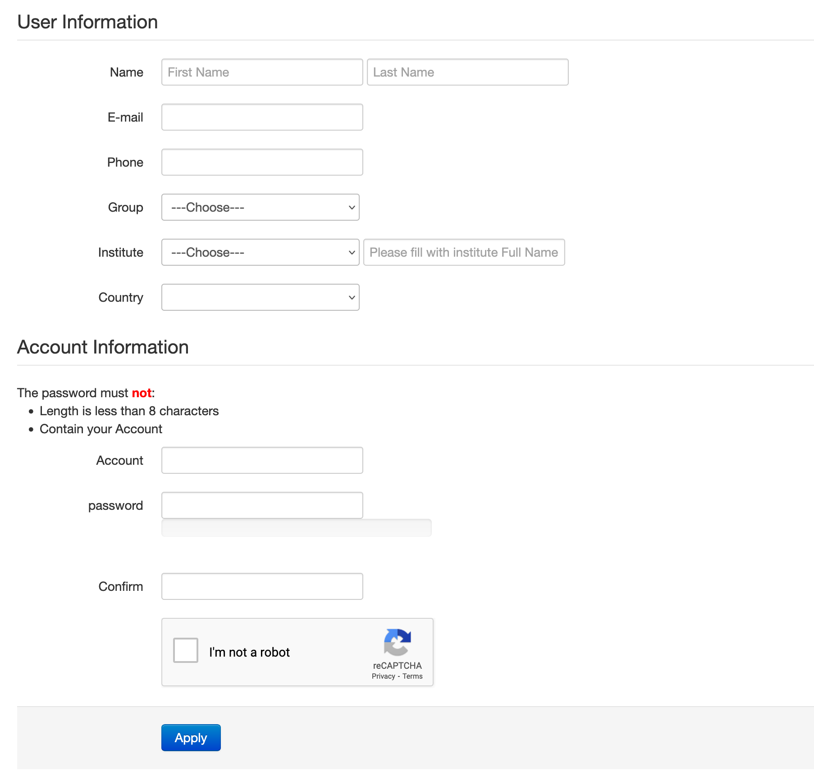

****************
DiCOS Account
****************

.. sectionauthor:: Mike Yang <mike.yang@twgrid.org>

==========================
Apply for a DiCOS Account
==========================

Step 1: DiCOS Account Application
^^^^^^^^^^^^^^^^^^^^^^^^^^^^^^^^^^^

* Go to `DiCOS Account Page <http://canew.twgrid.org/ApplyAccount/ApplyAccount.php>`_ to apply DiCOS account.

.. image:: image/dicos_apply_account_main.jpg

.. list-table::
   :header-rows: 1

   * - Method
     - Applicant
   * - Apply DiCOS Account
     - Non-Academia Sinica Users 
   * - Academia Sinica SSO
     - Academia Sinica Users

.. note::

   If you are a member of Academia Sinica, please use AS-SSO (single sign-on) to register your DiCOS account.

Step 2: Personal Information
^^^^^^^^^^^^^^^^^^^^^^^^^^^^^^^^^^^

* Fill in your personal information,
* Select your research group. (Your PI will approve your application)
* Setup account / password in DiCOS

.. note::

   If you are logging with Academia Sinica SSO, the default DiCOS account will be the same to the AS-SSO account.

Step 3: Confirm your e-mail address
^^^^^^^^^^^^^^^^^^^^^^^^^^^^^^^^^^^^^

* Check your mailbox and find our confirmation email (see format as below). Verify by clicking the url.

::

   From: DiCOS <DiCOS-Support@twgrid.org>
           
   Dear User (<dicos_user>):
   
           Thanks for signing up DiCOS!
           Your application is been accepted.
           Please go to the following url to verify your email.
           https://canew.twgrid.org/ApplyAccount/xxxxxx
   
           Please wait for your group leader's approval to activate your account.
   
           Best Regards,
           Academia Sinica Grid Computing Centre (ASGC)
           Taiwan
   
   =======================================================
   
   Academia Sinica Grid Computing Certification Authority
   email: asgcca@grid.sinica.edu.tw
   Phone: +886-2-2789-8312
   Fax:   +886-2-2789-6793
   https://canew.twgrid.org
   
   ========================================================

Step 4: PI's approval
^^^^^^^^^^^^^^^^^^^^^^^^^^^^^^^^^^^

* Wait for your PI to approve the application. You will get a notification email when it's approved.

==========================================
Edit DiCOS Account Password/Profile
==========================================

DiCOS user could change the password and update the information of the user profile through DiCOS web: https://dicos.grid.sinica.edu.tw/profile/info. Please follow the instruction on the webpage to finish the modification.

.. list-table::
   :header-rows: 1

   * - Action
     - Valid Time
   * - Edit password
     - Immediately after modification
   * - Edit user information
     - Immediately after modification
   * - Change Group
     - Will need to wait for the approval of new group PI

==========================
DiCOS Account Lifetime
==========================

The default lifetime of DiCOS account is **1 year**. The DiCOS system will send you a mail to extend your account lifetime **15 days prior to the expiration** of the account. The content of the reminder mail will be like the following paragraphs.

::

   Dear User (<dicos_user>):
  
       Your DiCOS account will be expired in 15 days.
       Please extend lifetime of your account
       through https://canew.twgrid.org/ApplyAccount/extendexpiry.php?dicos_user
  
       Note that if your account have been expired,
       you will not be able to sign in to DiCOS UI or web page.
       If you have more question, please email for us.
  
       Regards
       DiCOS-Support

Please follow the procedure to extend the account lifetime if you would like to continuously use the DiCOS account. Once your account expired, you will receieve a mail to notify you the expiration of the account, the contents will be something like:

::

   Dear User (<dicos_user>):
   
        Your DiCOS account is expired.
        Please extend lifetime of your account and update user information.
        through https://canew.twgrid.org/ApplyAccount/extendexpiry.php?dicos_user
   
        Note that if your account have been expired,
        you will not be able to sign in to DiCOS UI or web page.
        If you have more question, please email for us.
   
        Regards
        DiCOS-Support

==========================
DiCOS Account Flowchart
==========================

The following flowchart presents the application of the DiCOS account and the flows of the state change of the DiCOS accounts. For your potential interests.

.. image:: image/dicos_account.png
   :width: 800
   :alt: DiCOS Account Flowchart

