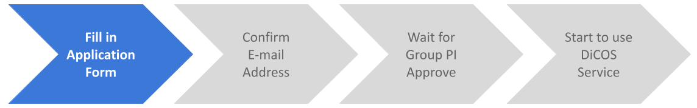
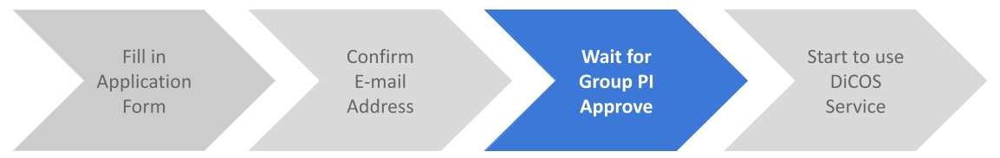

****************
DiCOS Account
****************

.. sectionauthor:: Mike Yang <mike.yang@twgrid.org>, Mandy Yang <mandy.yang@twgrid.org>, Jing-Ya You <jingya.you@twgrid.org>

==========================
Apply for a DiCOS Account
==========================

* Go to `DiCOS Account Page <http://canew.twgrid.org/ApplyAccount/ApplyAccount.php>`_ to apply DiCOS account.

.. image:: image/dicos_apply_account_main.jpg

.. list-table::
   :header-rows: 1

   * - Channel
     - Applicant
   * - Apply DiCOS Account
     - Non-Academia Sinica Users 
   * - Academia Sinica SSO
     - Academia Sinica Users

.. note::

   If you are a member of Academia Sinica, please use AS-SSO (single sign-on) to register your DiCOS account.

------------------------
Non-AS Users
------------------------

Step 1: Personal Information
^^^^^^^^^^^^^^^^^^^^^^^^^^^^^^^^^^^

* Fill in your personal information
* Select your research group. (Your PI will approve your application)
* Setup account / password in DiCOS

.. note::

   * Please setup your password in a secure way (you may refer to `this link <https://security.web.cern.ch/recommendations/en/passwords.shtml>`_ for chooing a secure password), and don't share it to anyone. DiCOS users have the obligation to keep their DiCOS account safe. Any malicious activities will be logged and DiCOS administrators keep the right to suspend the suspicious account if necessary.

Step 2: Confirm your e-mail address
^^^^^^^^^^^^^^^^^^^^^^^^^^^^^^^^^^^^^

* Check your mailbox and find our confirmation email (see format as below). Verify by clicking the url in the e-mail.

::

   From: DiCOS <DiCOS-Support@twgrid.org>
           
   Dear User (<dicos_user>):
   
           Thanks for signing up DiCOS!
           Your application is been accepted.
           Please go to the following url to verify your email.
           https://canew.twgrid.org/ApplyAccount/xxxxxx
   
           Please wait for your group leader's approval to activate your account.
   
           Best Regards,
           Academia Sinica Grid Computing Centre (ASGC)
           Taiwan
   
   =======================================================
   
   Academia Sinica Grid Computing Certification Authority
   email: asgcca@grid.sinica.edu.tw
   Phone: +886-2-2789-8312
   Fax:   +886-2-2789-6793
   https://canew.twgrid.org
   
   ========================================================

Step 3: PI's approval
^^^^^^^^^^^^^^^^^^^^^^^^^^^^^^^^^^^

* Wait for your PI to approve the application. You will get a notification email when it's approved.

Step 4: Start to use DiCOS services
^^^^^^^^^^^^^^^^^^^^^^^^^^^^^^^^^^^^^^

* Congratulations! You could start using DiCOS services now!

------------------------
AS Users (via SSO)
------------------------

Step 1: Sign-up with Academia Sinica SSO 
^^^^^^^^^^^^^^^^^^^^^^^^^^^^^^^^^^^^^^^^^^^^

Step 2: Fill in application form
^^^^^^^^^^^^^^^^^^^^^^^^^^^^^^^^^^^^

* Setup account / password in DiCOS
* Your PI will get the notification of your application

.. note::

   * If you are logging with Academia Sinica SSO, the default DiCOS account will be the same to the AS-SSO account.
   * After registration, your DiCOS account and the AS-SSO account will be independent. That is, the password of your DiCOS account is not necessary to be the same to that of AS-SSO account.
   * Please setup your password in a secure way (you may refer to `this link <https://security.web.cern.ch/recommendations/en/passwords.shtml>`_ for chooing a secure password, and a password security check will be done while you setup the password), and don't share it to anyone. DiCOS users have the obligation to keep their DiCOS account safe. Any malicious activities will be logged and DiCOS administrators keep the right to suspend the suspicious account if necessary.

Step 3: Start to use DiCOS services
^^^^^^^^^^^^^^^^^^^^^^^^^^^^^^^^^^^^^^

* Congratulations! You could start using DiCOS services now!

==========================================
Edit DiCOS Account Password/Profile
==========================================

DiCOS user could change the research group, institute and the passwords via `this link <https://canew.twgrid.org/ApplyAccount/nocertModify.php>`_. Please input your registered e-mail and then follow the instructions of the e-mail to finish the modification.

.. list-table::
   :header-rows: 1

   * - Action
     - Valid Time
   * - Edit password
     - Immediately after modification
   * - Edit user institute
     - Immediately after modification
   * - Change Group
     - Will need to wait for the approval of new group PI

.. note::

   * Group change will need the approval of new proup PI to finish the process
   * DiCOS user profile could be found in: https://dicos.grid.sinica.edu.tw/profile/info

==========================
DiCOS Account Lifetime
==========================

The default lifetime of DiCOS account is **1 year**. The DiCOS system will send you a mail to extend your account lifetime **30, 15, 7 days prior to the expiration** of the account. The content of the reminder mail will be like the following paragraphs.

::

   Dear User (<dicos_user>):
  
       Your DiCOS account will be expired in 15 days.
       Please extend lifetime of your account
       through https://canew.twgrid.org/ApplyAccount/extendexpiry.php?dicos_user
  
       Note that if your account have been expired,
       you will not be able to sign in to DiCOS UI or web page.
       If you have more question, please email for us.
  
       Regards
       DiCOS-Support

Please follow the procedure to extend the account lifetime if you would like to continuously use the DiCOS account. 

.. note::

   The recovery of an expired DiCOS account could be only valid for a short period of time. The DiCOS administrator could delete the expired accounting for security reason without notifying the users. Please keep your account in valid state if you would like to use the DiCOS account continuously.

==========================================
Apply for a DiCOS Group
==========================================

If you would like to join DiCOS as a PI of a specific research group. Please e-mail to DiCOS-Support@twgrid.org and attached the following messages for application:

.. list-table:: DiCOS Group Registration Fields
   :header-rows: 0

   * - Group name
     - A name for UNIX identification, length no more than 40 characters, upper & lower cases allowed
   * - PI Name
     - 
   * - PI E-mail
     - 
   * - PI Institute
     - 

In Chinese:

.. list-table:: DiCOS Group Registration Fields
   :header-rows: 0

   * - Group 名稱
     - 需要一個不能含空格或特殊符號的 40 字以內簡稱
   * - PI 名字
     - 含中英文
   * - PI E-mail
     - 
   * - PI 所屬單位
     - 

