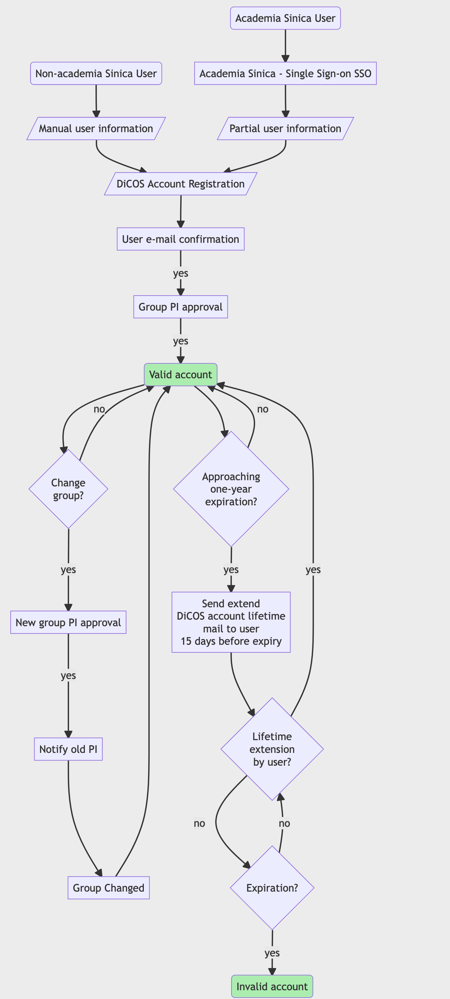
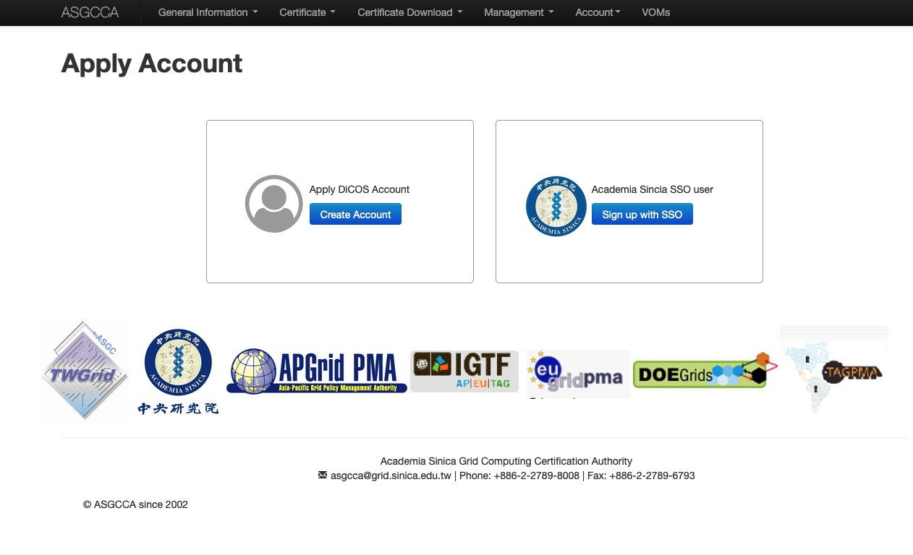
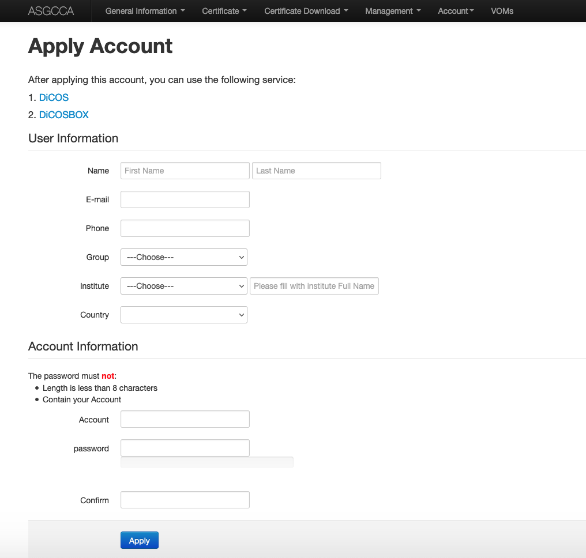
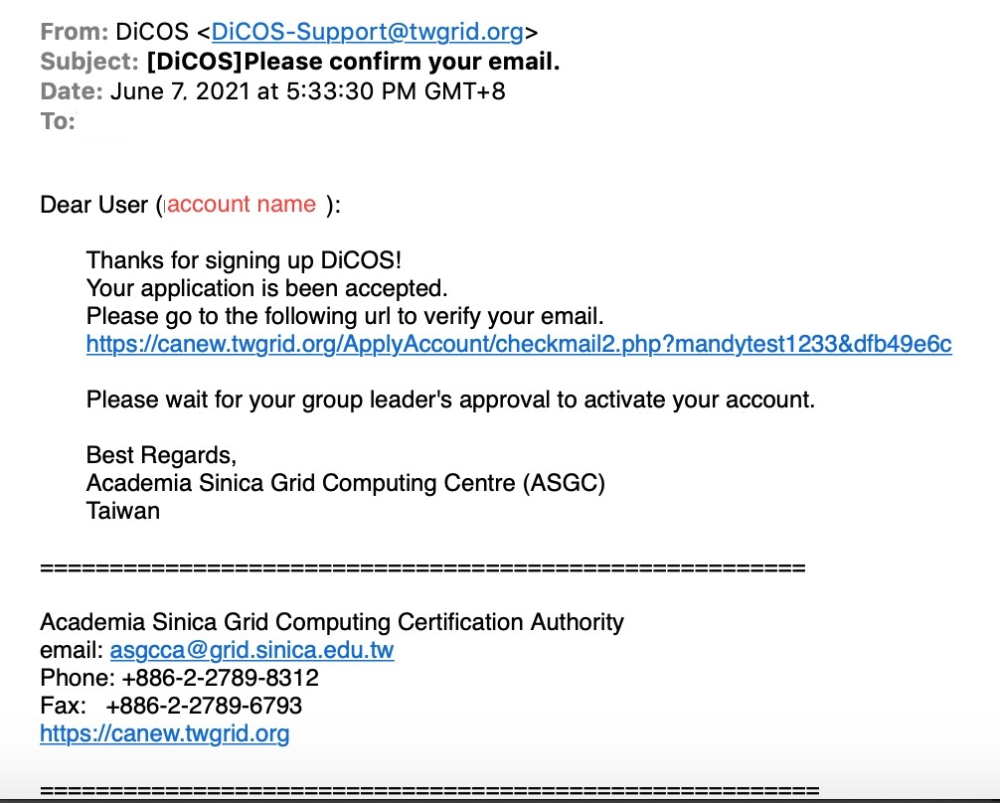

Apply for a DiCOS Account
==========================

Step 1: DiCOS Account Application
^^^^^^^^^^^^^^^^^^^^^^^^^^^^^^^^^^^

* `Apply DiCOS Account <http://canew.twgrid.org/ApplyAccount/ApplyAccount.php>`_

.. list-table:: DiCOS Account Application
   :header-rows: 1

   * - Method
     - Applicant
   * - Create New DiCOS account
     - Normal Users 
   * - Sign up with Academia Sincia SSO
     - If you are Academia Sinica users with SSO access

Step 2: Personal information
^^^^^^^^^^^^^^^^^^^^^^^^^^^^^^^^^^^

* Fill in your personal information,
* Select your research group. (Your PI will approve your application.)
* Setup account / password in DiCOS

Step 3: Confirm your email
^^^^^^^^^^^^^^^^^^^^^^^^^^^^^^^^^^^

* Check your mailbox and find our confirmation email(see format as below). Verify by clicking the url.

Step 4: PI's approval
^^^^^^^^^^^^^^^^^^^^^^^^^^^^^^^^^^^

* Wait for your PI to approve the application. You will get a notification email when it's approved.
