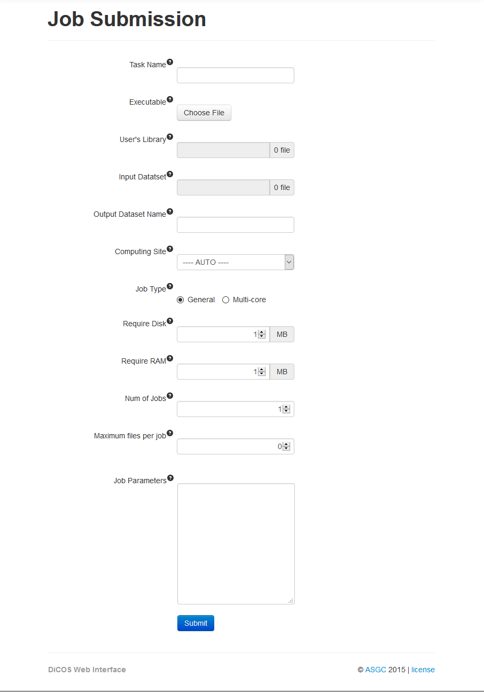

DiCOS Web UI
===============

=============================================
About Certificates & VO to init proxy
=============================================

#. [Apply for certificate](wiki:/apply_for_certificate)
#. [Import certificate to browser](wiki:/import_certificate_to_browser)
#. [Join Virtual Organization](wiki:/join_virtial_organization)

=============================================
Step 0. Login
=============================================

Click the login button at top right.

=============================================
Step 1. Initiate Proxy
=============================================
After logining, you have to import your `usercert.pem`, `userkey.pem`, and enter passphrase to initiate proxy. System will verify your identity, then help you to submit jobs. 

.. list-table:: The index page of DiCOS
   :header-rows: 1

   * - Field Name
     - Description
   * - **Your Certificate**
     - Select the ``usercert.pem`` file.
   * - **Your Private**
     - Select the ``userkey.pem`` file.
   * - **Passphrase**
     - The Certificate password.
   * - **Lifetime**
     - Available time after proxy initial, default time is 72 hours, maximum time: 168 hours, minimum time: 1 hour.

=============================================
##Step 1.1 First Initiate Proxy {#title1.1}
=============================================
First proxy initial, you need to setup some field of Profile page.

=============================================
#Step 2. Upload File
=============================================

At Data Management page, upload your input files or binary files before job submission.

- **Attention:**  
    - File name cannot be same  
    - A Dataset is defined as a set of File  
    - A Container is defined as a set of Dataset  
    - Dataset and Container can submit job in batch mode  
    - Container include Container and Dataset, but Dataset only include File  
    - Unlimited multi-layer(but only Container can repeat)  
    - Cannot change the name of Container, Dataset and File  
    - Only File can be removed  
    - If you have several input files, you should compress them (tar) by yourself before submission, and write decompress command (tar –zxf filename) in your script.  

=============================================
Step 3. Job Submission
=============================================

The describe of parameters are as follow:  

- **Task Name:** Defined name for task. Note that task name cannot be the same.  
- **Executable:** Executable files (binary or script)  
- **User’s Library:** Function library used for executing task, can be left blank or select your input files.  
- **Input Dataset:** Choose input file, dataset or left blank.  
    - If you left blank, can upload files up to 1000.  
    - Select file or dataset, system may calculate number of files, the limit is

    ::

        “Num of Jobs” × “Maximum files per job” ~= “Num of Input Files”

- **Output Dataset Name:** Dataset name for output after job finish. Default name is Task Name.  
- **Computing Site:** Select which site you want to submit. Default site is to select automatically the most free site to submit your job.  
- **Job Type:** Select your job type.  
- **Require Disk**  Set the disk required
- **Require Ram**  Set the Ram required
- **Num of Jobs:** Resource used for the task. Single job submission is set to 1; Batch job submission will separate according to the number of input files.  
- **Maximum file per job:** Set the maximum input files for one job.  
- **Job Parameter:** Provides advanced option (please using blank between parameters)  

=============================================
Step 4. Job Monitoring
=============================================

At Job Monitoring page, you can monitor job status and according time to search.

=============================================
Step 5. Download File
=============================================

Results can be downloaded at Data Management page or perform other operations when job is completed.

If you still confused, you can click [general example](wiki:/use_case) for more explanation.

========================
#Other Explanations:
========================

-------
Scope
-------

.. image:: dicos101/image/scope.jpg

* To divide into two part  
    - User’s scope (for example: ``twgrid-user-mandy4318``)
    - Shared scope  
* System only allow copy files in shared scope  
* You can copy File to other Dataset or copy File from shared scope to Dataset of your user’s scope.  
* You can copy Dataset to other Container or copy Dataset from shared scope to Container of your user’s scope.  

-------------------------
Auto Correction
-------------------------

