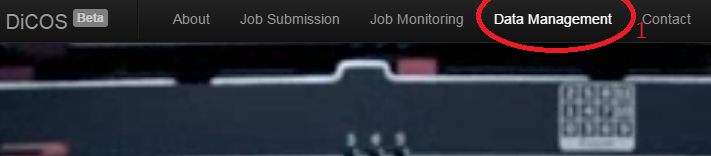
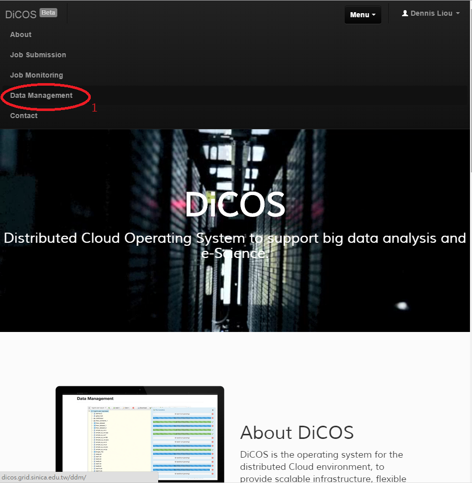
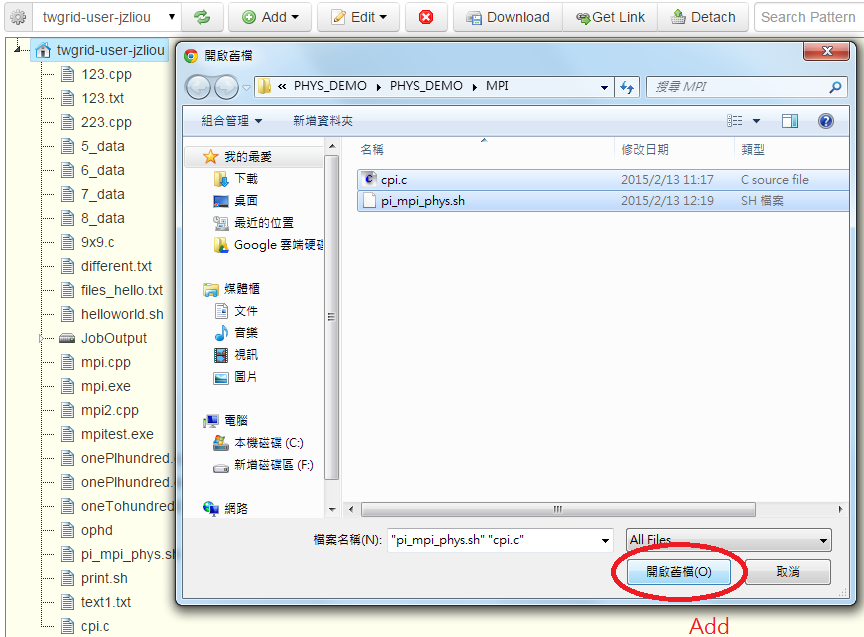
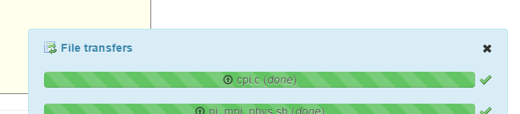
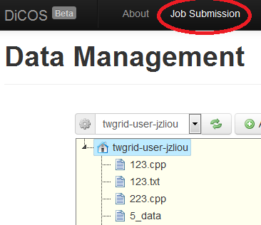
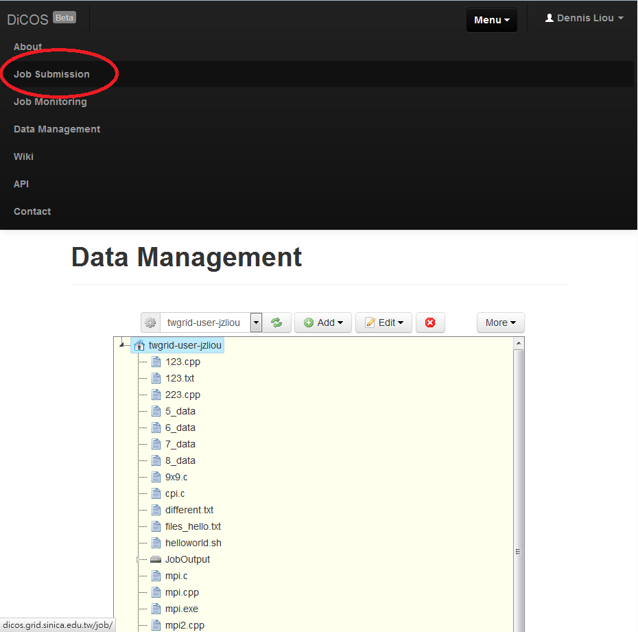
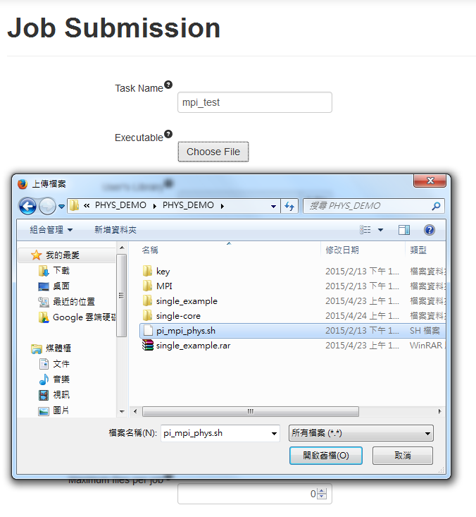
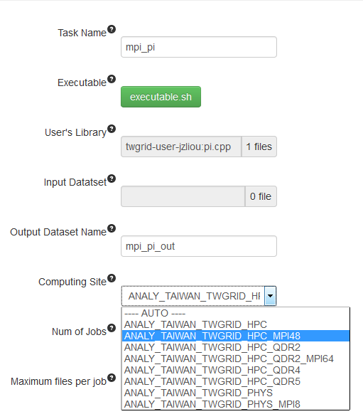

MPI Job
=========

**Attention**:

If you want to submit a MPI job, the mode to complier and to execute is different from submit a general job. Just like exemple.

First to do is the same as :doc:`submit a general job <use_case>`. If you were confuse about it, just do like submit a general job to step2. And continue to do.

1. First, login to the DiCOS and go to Data Management page.

or

1-1. Add your input data file, subroutine here.

2. Second, move to the submission page.

3. Fill in the information that request.

(Remember to choose a site that contain mpi software.)

After submit, to see the result is fully same as :doc:`general job <use_case>`.

