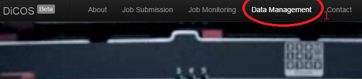
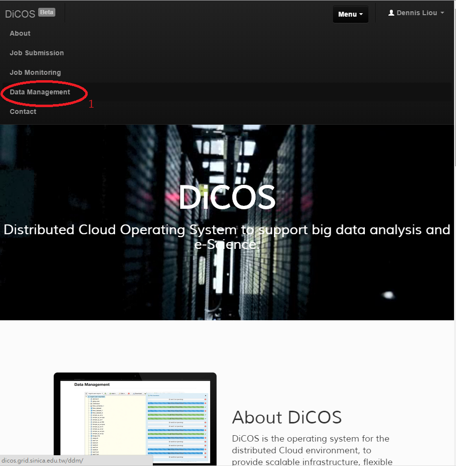
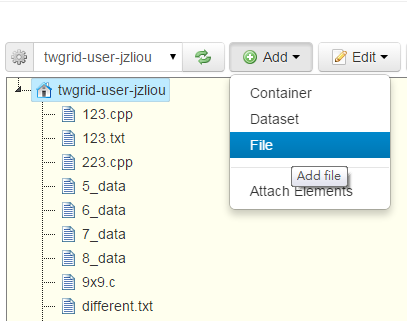
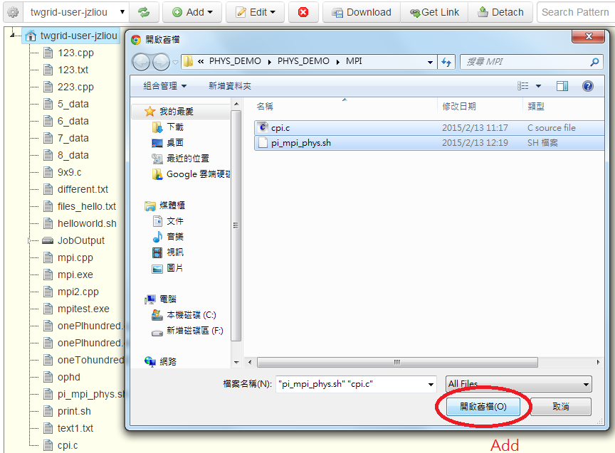
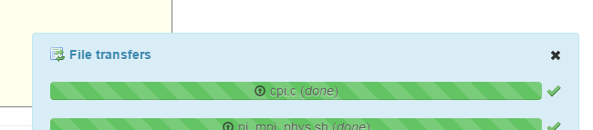
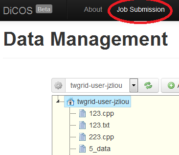
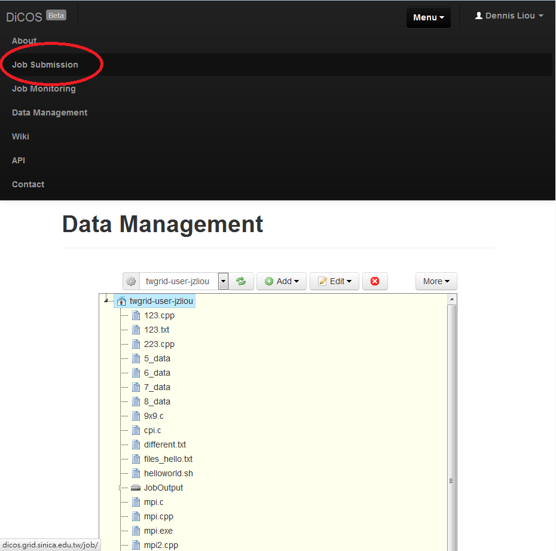
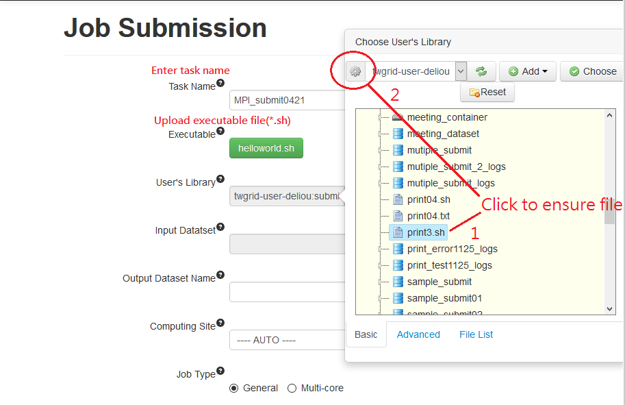
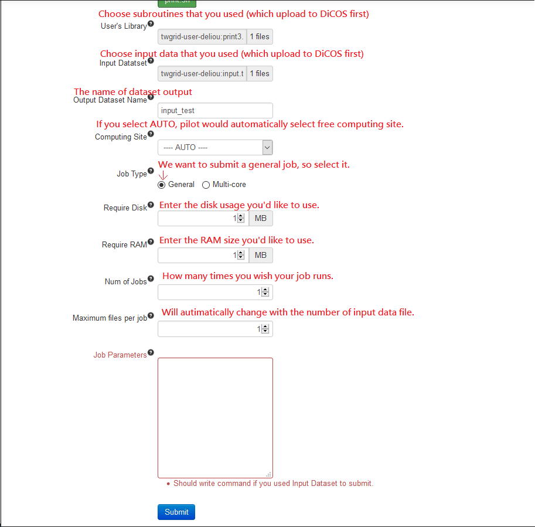
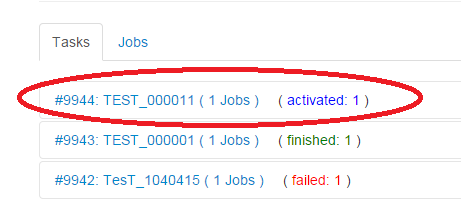

Use Case
==========

1. First, login to the DiCOS and go to Data Management page.

or

1-1. Add your input data file, subroutine here.

2. Second, move to the submission page.

3. Fill in the information as requested.

Choose executable (\*.sh)  
Executable file example(print.sh)  

::
    
    #/bin/bash
    filename=( "$@" )
    for arg in "${filename[@]}"; do
            cat $arg >> print.out
            echo "\n" >> print.out
    done

Job Parameters field should write

::

    ./print.sh 5_data.txt 6_data.txt 7_data.txt 8_data.txt

  
4. After click submit

5. Finished

========================
Example file download
========================
 
Executable file: `print.sh <https://www.dropbox.com/s/0ls8hazlchh4epq/print.sh?dl=0>`_

Source file:  
* `5_data <https://www.dropbox.com/s/p4a833j7tsmp2l9/5_data.txt?dl=0>`_
* `6_data <https://www.dropbox.com/s/5pyw6vmvmjm9pxt/6_data.txt?dl=0>`_
* `7_data <https://www.dropbox.com/s/8krr8twd933i00c/7_data.txt?dl=0>`_
* `8_data <https://www.dropbox.com/s/lmwxcu4lob7afb6/8_data.txt?dl=0>`_
