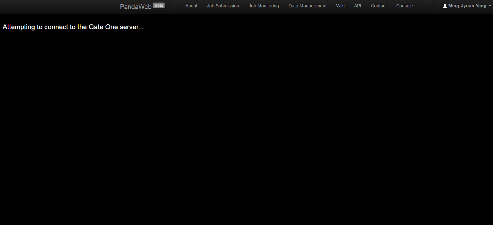
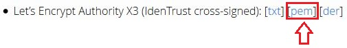
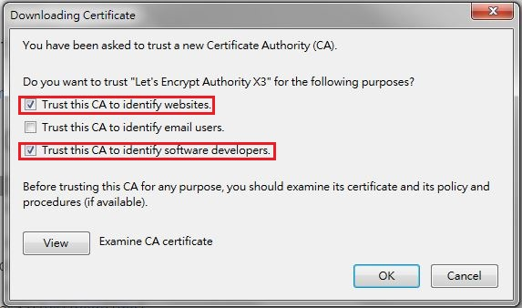
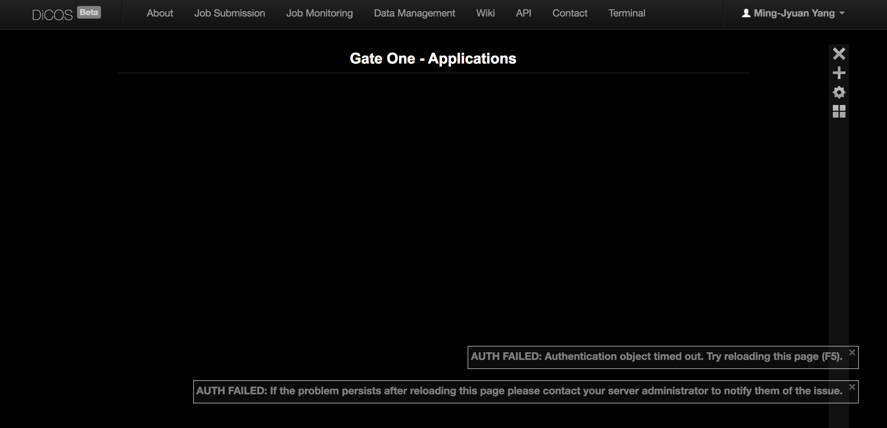
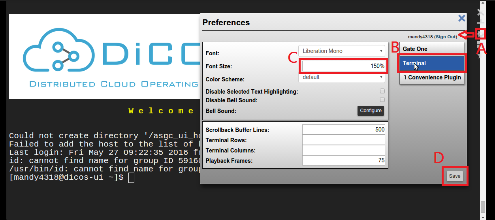
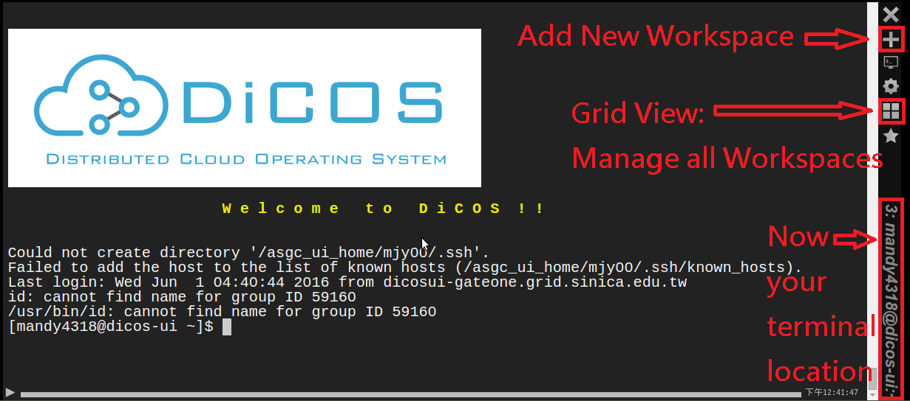
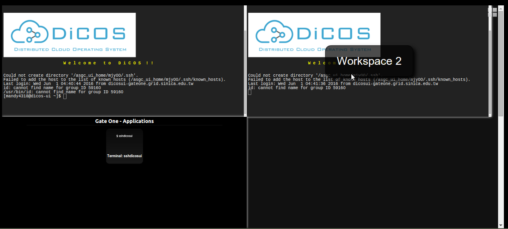
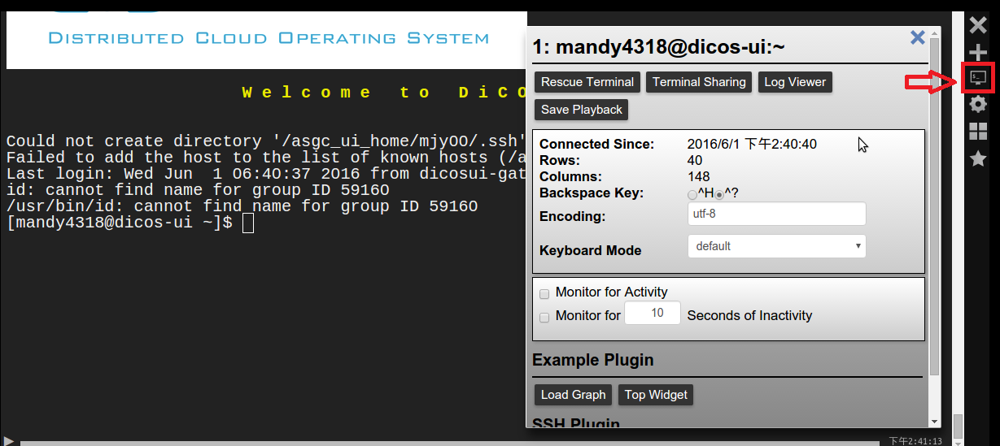
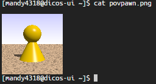

Web Terminal (Web Console)
================================

Now web console is online:    
1. Login first before using it.  
2. You can initial proxy on web page or use command line.  

===================
Support Browser
===================

.. list-table:: CVMFS (CernVM File System)
   :header-rows: 0

   * - Browser OS
     - Windows 7
     - Windows 10
     - Ubuntu
     - MacOS
   * - IE
     - OK(10+)
     - OK(MS edge)
     - None
     - None
   * - Firefox
     - OK
     - OK
     - OK
     - OK
   * - Chrome
     - OK
     - OK
     - OK
     - OK
   * - Safari
     - No(ver. 5.1.7)
     - No(ver. 5.1.7)
     - None
     - OK

===================
Troubleshooting
===================

* Screen is as same as the following image or a blank screen (usually happened in Win7 Firefox),

1. Go to `Let's Encrypt Certificates page <https://letsencrypt.org/certificates/>`_
2. Clicke Let’s Encrypt Authority X3 (IdenTrust cross-signed) [pem]

3. Select **Trust this CA to identify websites.** and **Trust this CA to identify software developers.** , then click **OK**

4. Back to Web Console and you can see it works normally 

* Screen shows only "Gate One - Applications" as the following image

   - Due to incorrect clock time (slower than normal time), please check your computer.

===================
Setting
===================

----------
Shortcut  
----------

.. list-table:: CVMFS (CernVM File System)
   :header-rows: 0

   * - Action OS
     - Windows
     - Linux
     - MacOS
   * - Paste
     - Shift + Insert
     - Shift + Insert
     - ⌘-v
   * - View the Help
     - Shift + F1
     - Shift + F1
     - 
   * - Open Terminal
     - Ctrl + Alt + N
     - Ctrl + Alt + N
     -
   * - Close Terminal
     - Ctrl + Alt + W
     - Ctrl + Alt + W
     -

------------------------------
Terminal Font Size   
------------------------------

- A. Click Setting icon -> B. Select Terminal -> C. Set Font Size field >100% e.g. 150% -> D. Save your setting  

------------------------------
New Workspace and Manage   
------------------------------

- You can add new workspaces and use Grid View to switch them (Max terminal: 10)   
- Current terminal location will show on the bottom right  

- Grid View can swtich your existed workspaces  

---------------------------------
Terminal Application Panel
---------------------------------

- Click Panel icon -> Here can Log Viewer (Activity log), Save Playback (a HTML file of your command history)....etc.  

------------------------------
See Images
------------------------------

- cat <your_image_name> e.g. cat povpawn.png   
- and you can right-click to save images  

