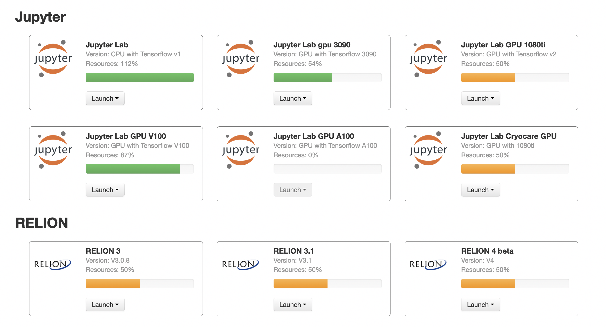

************
DiCOSApps
************

.. sectionauthor:: Mike Yang <mike.yang@twgrid.org>, Tsung-Hsun Wu <tsung-hsun.wu@twgrid.org>

======================
DiCOSApp Introduction
======================

DiCOSApp is web based micro-service that handles different application individually. Here is the document to introduce its SPEC for each APP.

----------------------
Use DiCOSApp
----------------------

Login in to `DiCOS web <https://dicos.grid.sinica.edu.tw>`_ and then go to https://dicos.grid.sinica.edu.tw/dockerapps/ to start using DiCOSApps. The remaining resources are displayed for each DiCOSApp. Like the image below, click ``launch`` button (and proper lifetime of the application), and then start to use the application.

------------------------
CryoEM Specific APPs
------------------------

.. list-table:: CryoEM specific APPs
   :header-rows: 1

   * - APP name
     - CPU cores
     - GPU
     - Memory
     - SSD
   * - CisTEM
     - 32
     - 0
     - 100GB
     - no
   * - RELION3
     - 16
     - 4 (1080Ti)
     - 380GB
     - yes
   * - RELION2
     - 16
     - 4 (1080Ti)
     - 380GB
     - yes
   * - CisTEM-cluster
     - 40 per job, max to 600
     - 0
     - 256GB ~ 3840GB
     - no
   * - CryoSPARC(*no longer up2date*)
     - 16
     - 1 (1080Ti)
     - 380GB
     - yes

------------------------
Jupyter Notebooks
------------------------

.. list-table:: Jupyter Notebooks
   :header-rows: 1

   * - APP name
     - CPU coures
     - GPU
     - Memory
     - SSD
   * - JupyterLab(CPU)
     - 12
     - 0
     - 64GB
     - yes
   * - JupyterLab(GPU)
     - 12
     - 1 (P100)
     - 128GB
     - yes

-----------------------------
RELION Job Configuration
-----------------------------

What's the ideal MPI number and thread number with current RELION APP?
^^^^^^^^^^^^^^^^^^^^^^^^^^^^^^^^^^^^^^^^^^^^^^^^^^^^^^^^^^^^^^^^^^^^^^^^^

*4 MPI* with *4 threads*. If it's GPU accelerated process, please use *5 MPI* with *4 threads*

What's the ideal MPI number and thread number with Premium RELION v100 app?
^^^^^^^^^^^^^^^^^^^^^^^^^^^^^^^^^^^^^^^^^^^^^^^^^^^^^^^^^^^^^^^^^^^^^^^^^^^^^^

The v100 GPU is relatively powerful GPU against GTX-1080Ti. So, it can bear much load than 1080ti. In principle, with following job setup, user can get pretty nice speed up when dealing 2D and 3D classifications:

* *2D*: Number of *MPI procs: 16*, Number of *Threads: 1*
* *3D*: Number of *MPI procs: 9*, Number of *Threads: 2*

What if RELION encounters error?
^^^^^^^^^^^^^^^^^^^^^^^^^^^^^^^^^^^^^^^^^^^^^^^^^^^^^^^^^^^^^^^^^^^^^^^^^^^^^^

RELION is often stable. When error occurs, it would usually caused by:

1. Memory or resources are not enough. For such error, simply reducing Thread number would just help. If the error lasts, then try reducing MPI number.
2. Input file error. Checking log and removing problematic file indicated in log may just solve this issue.

=========================
DiCOSApp Data Handling
=========================

The DiCOSApp is ephemeral and isolated application, everything changed or created in APP will be wiped out after the APP is terminated. However, there are three persistent spaces, everything storing there will be kept:

**NOTICE: The CryoEM data from ASCEM to ASGC will be stored at /cryoEM/tmp**

--------------------------
1. User HOME space
--------------------------

- The user home space is connected inside the APP by following paths:

::

   -  ~/data/
   -  $HOME/data
   -  /dicos_ui_home/[ your username ]/data

- **Please note, the user home space doesn't guarantee any data protection or space for every user. So, please be careful what you store on it. And please make backup by yourself, if you will only use home space.**

- All data in user home space can be also accessible from outside APP by sftp (using `filezilla <https://filezilla-project.org/download.php>`_ or sftp client) with following endpoints:

::

   - dicos-ui02.grid.sinica.edu.tw
   - dicos-ui04.grid.sinica.edu.tw

------------------------------------
2. DiCOSBOX(Cloud storage) space
------------------------------------

- DiCOSBOX is Dropbox-like storage, it is also connected inside the APP by following path:
::

   - ~/DiCOSBox
   - $HOME/DiCOSBox
   - /dicos_ui_home/[ your username ]/DiCOSBox

- DiCOSBOX can be also accessible from outside APP by login to following page:

  * https://dicosbox.twgrid.org

------------------------------------------------
3. CryoEM group space (CryoEM user only)
------------------------------------------------

- CryoEM group space is for CryoEM user only, which must be requested by PI.
- CryoEM group space is connected inside the APP by following path:

::

   - /cryoEM/

- All data in CryoEM group space can be also accessible from outside APP by sftp( using `filezilla <https://filezilla-project.org/download.php>`_ or sftp client) with following endpoints:

::

   - dicos-ui02.grid.sinica.edu.tw
   - dicos-ui04.grid.sinica.edu.tw

- The path is also */cryoEM/*

====================================================
Request for Specific Application Installation
====================================================

If you have special requirement for the application installation, please contact to DiCOS-Support@twgrid.org.
