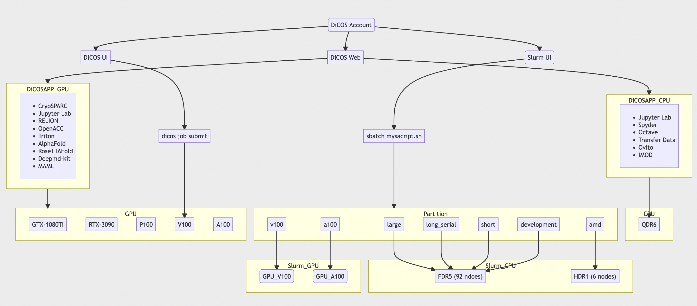

*******************
DiCOS Resources
*******************

.. sectionauthor:: Mike Yang <mike.yang@twgrid.org>

===================
DiCOS Resources
===================

.. list-table:: ASGC Resources
   :header-rows: 1

   * - Cluster
     - Worker Nodes
     - Total CPU cores
     - CPU/node
     - CPU model
     - Memory/node
     - Disk space/node
     - Network
     - GPU model
     - GPU/node
     - Note
   * - HPC_FDR5
     - 92
     - 2208
     - 24
     - Intel(R) Xeon(R) CPU E5-2650 v4 @ 2.20GHz
     - 125GB
     - 2TB (System: 400GB)
     - 10GbE
     - N/A
     - N/A
     - Slurm
   * - HPC_HDR1
     - 6
     - 768
     - 128
     - AMD EPYC 7662 64-Core Processor
     - 1520GB
     - 1TB (System: 20GB)
     - 100GbE
     - N/A
     - N/A
     - Slurm
   * - GPU_GTX-1080Ti
     - 8
     - 256
     - 32
     - Intel(R) Xeon(R) CPU E5-2620 v4 @ 2.10GHz
     - 768GB
     - 1TB (System: 20GB)
     - 10GbE
     - GTX-1080Ti
     - 8
     - DiCOSApp
   * - GPU_RTX-3090
     - 4
     - 256
     - 64
     - AMD EPYC 7302 16-Core Processor
     - 1024GB
     - 1TB (System: 20GB)
     - 100GbE
     - RTX-3090
     - 8
     - DiCOSApp
   * - GPU_RTX-3090-ASCEM
     - 6
     - 288
     - 48
     - AMD EPYC 7402 24-Core Processor
     - 512GB
     - 500GB (System: 20GB)
     - 100GbE
     - RTX-3090
     - 4
     - DiCOSApp
   * - GPU_P100
     - 4
     - 192
     - 48
     - Intel(R) Xeon(R) CPU E5-2650 v4 @ 2.20GHz
     - 512GB
     - 1TB (System: 20GB)
     - 10GbE
     - P100
     - 4
     - DiCOSApp
   * - GPU_V100
     - 6
     - 288
     - 48
     - Intel(R) Xeon(R) Gold 6126 CPU @ 2.60GHz
     - 768GB
     - 1TB (System: 20GB)
     - 10GbE
     - V100
     - 8
     - DiCOSApp, Slurm, DiCOS job submit
   * - GPU_A100
     - 2
     - 128
     - 64
     - AMD EPYC 7302 16-Core Processor
     - 1024GB
     - 1TB (System: 20GB)
     - 100GbE
     - A100
     - 8
     - DiCOSApp, Slurm

.. note::

   Update in 20220627

==================================
User Interface Node (Login Node)
==================================

.. list-table::
   :header-rows: 1

   * - User Interface Node
     - OS
     - Purpose
   * - dicos-ui02.grid.sinica.edu.tw
     - SLC 6
     - ``dicos`` | File download/upload
   * - dicos-ui04.grid.sinica.edu.tw
     - CentOS 7
     - ``dicos`` | File download/upload
   * - dicos-ui05.grid.sinica.edu.tw
     - CentOS 7
     - ``dicos`` | Job submission, File download/upload
   * - dicos-ui06.grid.sinica.edu.tw
     - CentOS 7
     - ``dicos`` | Job submission, File download/upload
   * - slurm-ui01.twgrid.org
     - CentOS 7
     - ``slurm`` | Job submission, File download/upload
   * - slurm-ui02.twgrid.org
     - CentOS 7
     - ``slurm`` | Job submission, File download/upload

.. note::

   The resources of the user interface node is limited, please don't run your jobs in the user interfaces, or your jobs will be killed without notice.

====================
DiCOS in a Nutshell
====================

The image below is the whole scheme of current DiCOS system at ASGC. Various entry points are provided for the users with different requirements.

.. note::

   Update in 20220627
